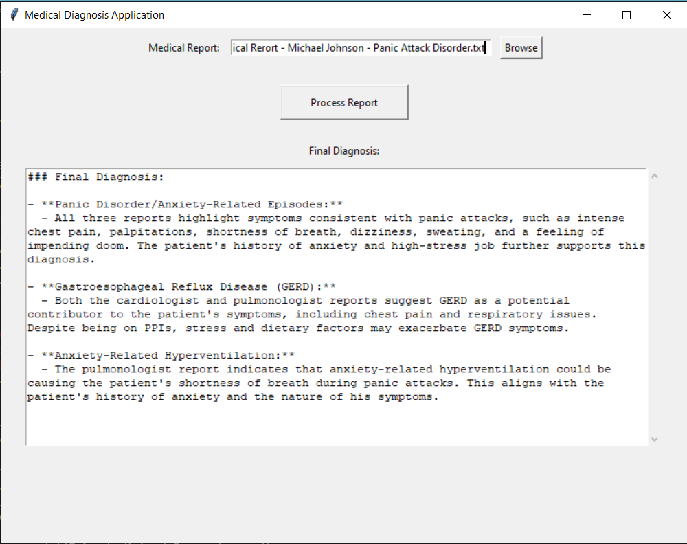

# AI-Agents-for-Medical-Diagnostics

A cutting-edge Python project designed to harness the power of specialized LLM-based AI agents for the analysis of intricate medical cases. This system amalgamates insights from diverse medical professionals to deliver comprehensive assessments and personalized treatment recommendations, showcasing the transformative potential of AI in multidisciplinary medicine.

## Current Version Overview

In this iteration, we have deployed three advanced AI agents utilizing GPT-4, each with a distinct focus on different facets of medical analysis. Medical reports are concurrently analyzed by these agents through threading, leveraging their specialized expertise. Each agent delivers unique recommendations and diagnoses. Upon completion, the results are synthesized by a large language model, which distills the findings and identifies three potential health issues for the patient.

### AI Agents

**1. Cardiologist Agent**

- **Focus**: Detect potential cardiac issues that could elucidate the patient's symptoms, including subtle conditions like arrhythmias or structural abnormalities that might evade initial evaluations.
  
- **Recommendation**: Propose additional cardiovascular testing or continuous monitoring to uncover latent heart-related problems. Offer management strategies if a cardiovascular issue is identified.

**2. Psychologist Agent**

- **Focus**: Evaluate if the symptoms correspond to a psychological condition, such as panic disorder or other anxiety-related issues. Assess the influence of stress, anxiety, and lifestyle factors on the patient’s overall health.
  
- **Recommendation**: Suggest appropriate psychological interventions (e.g., therapy, stress management techniques) or medications to address the psychological dimensions of the symptoms. Review and adjust current psychological management as needed.

**3. Pulmonologist Agent**

- **Focus**: Determine if symptoms like shortness of breath and dizziness stem from a respiratory condition, such as asthma or a breathing disorder, that could mimic cardiac symptoms.
  
- **Recommendation**: Recommend further respiratory evaluations, such as lung function tests or exercise-induced bronchoconstriction tests, to rule out underlying lung conditions. Suggest breathing exercises or other treatments if a respiratory issue is suspected.

## Future Enhancements

Future versions will aim to broaden the scope by incorporating additional AI agents specializing in various medical fields, such as neurology, endocrinology, and immunology, to deliver even more comprehensive analyses. These AI agents could leverage the [Assistant API from OpenAI](https://platform.openai.com/docs/assistants/overview) and utilize `function calling` and `code interpreter` capabilities to enhance their intelligence and efficacy. Moreover, advanced parsing methodologies will be introduced to handle more complex medical reports, enabling the system to accurately interpret and analyze a wider array of medical data.

## Repository Structure

- **Medical Reports Folder**: Contains a synthetic medical report of a patient with Panic Attack disorder.
- **Results Folder**: Stores the outputs of the agentic system.
  
**To run the code, please insert your OpenAI API key within the `apikey.env` file.**
